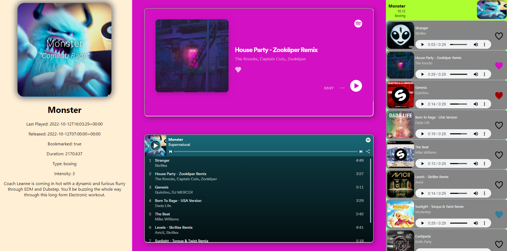

# SuperUnnatural

[SuperUnnatural Live Page](https://github.com/JoffreyCodes/superUnnatural-app)

## Table of contents

- [General info](#general-info)
- [Usage](#usage)
- [Features](#features)
- [Status](#status)
- [Credits](#credits)

## App Snapshot

  
 Version 1 

  

  
Proof of Concept

  
  
  

## General Info

### Backstory:

Supernatural is a VR game that promotes exercise through music. Each workout is a playlist of today's modern and yesterday's classical songs that are not only an enjoyable experience to "flow" or "box" to, but also serve to expose users to new or once-familiar music. The Supernatural app provides a feed of the user's workout history, along with access to the Spotify Playlist. However, navigating the Supernatural app for each song that you enjoy is a lenghty process, especially when having to navigate back and forth between Spotify and Supernatural to preview each song. I decided to build this app to expidite this process so that I can preview the songs to help me recall which songs I enjoyed, and save them onto a Spotify playlist for enjoying at a later time, likely during car rides.

SuperUnnatural is a single-page application that allows users to save, play, and preview workout songs that were recently played on Supernatural onto their Spotify "Liked" playlist.

## Tech

### Front-end

[[code]](https://github.com/JoffreyCodes/superUnnatural-app)
[[deployed]](https://github.com/JoffreyCodes/superUnnatural-app)

- Spotify api
- React
- Axios
- Javascript

### Back-end

[[code]](https://github.com/JoffreyCodes/superUnnatural-api)

- Python
- Flask

### DevOps

- AWS EC2
- AWS Route52
- Docker
- NGINX
- SSL Certbot

## Features

**List of features:**

Bells & Whistles:

- Matching album Spotify color for Spotify panel and Heart Save
- Spotify Panel color brightened by appending an `alpha value` to the retrieved hex color.

Proof of Concept:

- Displays 20 recent supernatural workouts (partial and completed) and the playlist tracks that were used.
- Users are able to select and unselect tracks to save to their playlist
- Current saved tracks persist across separate user sessions

**Future Works:**

- AWS Hosting
  - Back-end - Completed
  - Front-end - In Progress
- Spotify Player Integration - Completed
  - Integrated Spotify Player - Completed
  - Track Preview Selector - Completed
  - Access to artist Spotify page - TBD
- Workout Data Analytics and Visualizations - In Progress
  - Fitbit data integration - In Progress
- SQL Database Integration - TBD
  - Allow user to save comment on track using SN designated track ids

## Project Status

- Proof of concept - Completed
- V1 Proof of concept and web page design
  - V1.1 Initial Web Hosting - Completed
  - V1.2 Back and front end hosting using AWS EC2
- V2 - User data analytics, Workout rankings and Fitbit data - In development

## Project Challenges

- Spotify iFrames for full access to music track.
  - In order to prevent preview mode in Spotify Iframes tracks, the hosting web server must be held in an Ipv6 environment (HTTPS). This initially prevented my launch directly to an AWS server. Instead, I choose to host the front-end on GitHub pages to see if tthe preview mode Spotify Iframe issue resolves.
  - After successfully hosting on a Github pages environment, I learned that an IPv6 host will fail to communicate with an IPv4 host.
- HTTP (IPv4), HTTPS (IPv6), SSL and Domain Name System (DNS)
  - When intially hosting my front-end on Github pages, I learned that communication between my frontend server IPv6 will not communicate to my AWS backend server using IPv4.
  - Upgrading AWS IPv4 to IPv6 via SSL Certbot and registering a domain name.

## Credits

Joffrey Inocencio
